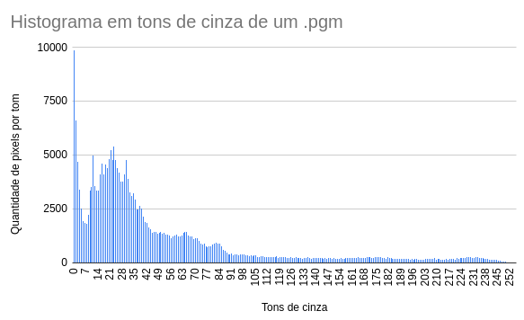
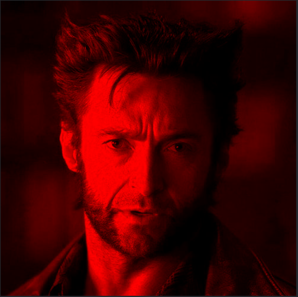
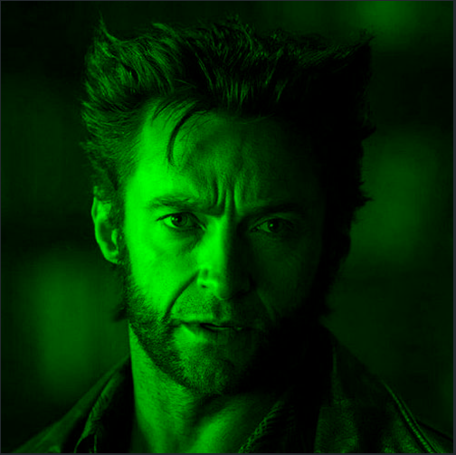
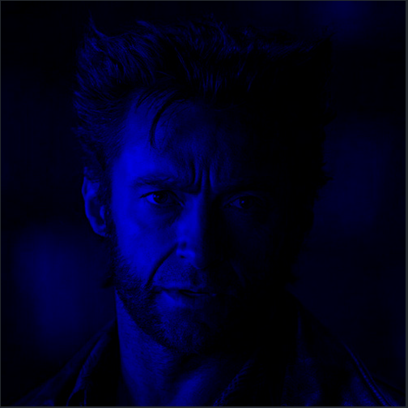

# Atividade 1 - Introdução à Computação Gráfica

<a href="https://github.com/kirodoras/icg-atividade1">
    Link para o projeto no Github
</a>
<div></div>
<a href="https://drive.google.com/drive/folders/1ZoJfgcR_GgwhNt9mpLPYq-YicyWGp-es?fbclid=IwAR2ZNCLwqNu_d5AzEVhsVylqtTcFgbRHOuv__dGxfqCCdOhyugavhycQBxU">
    Link para o projeto no Drive
</a>

### Clonar o Repositório
   ```bash
   git clone https://github.com/kirodoras/icg-atividade1.git
```
Este projeto visa realizar operações básicas de processamento de imagem utilizando linguagem C. As funcionalidades principais incluem a geração de histograma de tons de cinza e a separação de uma imagem colorida em suas três componentes RGB.

## Funcionalidades

### 1. Histograma de Tons de Cinza (PGM)

- **Descrição:** Gera os dados histograma de tons de cinza a partir de uma imagem PGM.
- **Arquivo:** `pgmtohisto.c`
- **Instruções de Uso:**
    1. Compile: 
    ```bash
    gcc pgmtohisto.c -o pgmtohisto
    ```
    2. Execute: 
    ```bash
    ./pgmtohisto nome_da_imagem.pgm
    ```
    3. O arquivo `histograma.txt` será gerado.
    4. Visualize: 
    ```bash
    cat histograma.txt
    ```

### 2. Separação em Componentes RGB (PPM)

- **Descrição:** Separa uma imagem colorida - .ppm - em suas três componentes RGB.
- **Arquivo:** `ppmtocomps.c`
- **Instruções de Uso:**
    1. Compile: 
    ```bash
    gcc ppmtocomps.c -o ppmtocomps
    ```
    2. Execute: 
    ```bash
    ./ppmtocomps nome_da_imagem.ppm
    ```
    3. Arquivos `component-red.ppm`, `component-green.ppm` e `component-blue.ppm` serão gerados.
    4. Visualize: 
    ```bash
    eog component-red.ppm
    ```
## Resultados

### 1. Histograma de Tons de Cinza

<div>
    
</div>

*Histograma gerado no software planilhas Google com os dados do adquiridos do arquivo histograma.txt*

<a href="https://docs.google.com/spreadsheets/d/1qnaxtwKiIwx7Ej_nnb_mynNd0W5vB6zNEUwMHyUjSaA/edit#gid=0">
    Link para o arquivo de planilha
</a>

### 2.1. Componente - Tons Vermelhos (RGB)

<div>
    
</div>

### 2.2. Componente - Tons Verdes (RGB)

<div>
    
</div>

### 2.3. Componente - Tons Azuis (RGB)

<div>
    
</div>

## Instruções Gerais

1. Certifique-se de ter as imagens no formato correto (PGM para o primeiro código e PPM para o segundo).
2. Substitua `nome_da_imagem` pelo caminho correto das suas imagens.

**Nota:** Este projeto foi desenvolvido na Universidade Federal de Sergipe, Departamento de Matemática, curso de Computação Grafica - Prof Evilson Vieira.
